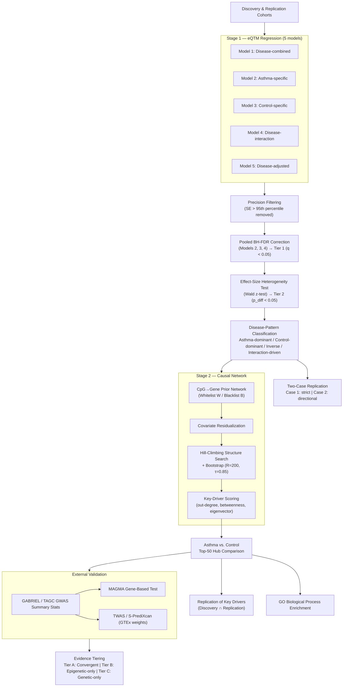

# Methods

**Disease-stratified epigenetic regulatory network analysis of asthma** — from cis/trans-eQTM discovery through Bayesian network–based causal key-driver identification.

---

## Pipeline overview

---

## Study design overview

A two-stage analytical framework was used to identify epigenetically regulated genes (eGenes) whose methylation–expression relationships are modified by asthma status, and to nominate causal regulatory hub genes within asthma-specific networks.

- **Stage 1** — Expression quantitative trait methylation (eQTM) analysis identifies cis- and trans-acting CpG–gene associations under five complementary regression models, evaluated in an independent discovery/replication design.
- **Stage 2** — CpG–gene pairs with a statistically supported disease interaction are used as directed structural priors for Bayesian network inference, from which regulatory hub genes (key drivers) are identified, compared between asthma and control groups, and evaluated for replication and functional enrichment.

## eQTM regression models

For each dataset (discovery, replication), five parallel linear regression models characterize disease-shared, disease-specific, disease-adjusted, and disease-discordant CpG–gene regulatory associations. Cis-eQTM pairs are defined as CpG–gene pairs within 1 Mb of one another; all remaining pairs are trans.

### Model 1 — Disease-combined

$$Y = \beta_0 + \beta_1 X + \sum_{k=1}^{K} \alpha_k Z_k + \varepsilon$$

Fitted in all subjects combined, with no disease-status term. $Y$ is gene expression, $X$ is the methylation M-value at a CpG site, and $Z_k$ ($k=1,\dots,K$) are covariates: age, recruitment site, array plate, and genotype/methylation PC1 in discovery ($K=4$); age alone in replication ($K=1$). Because $\beta_1$ is a single pooled coefficient, any disease-driven confounding is absorbed into the residual error.

### Models 2 & 3 — Asthma-specific and control-specific

$$Y = \beta_0 + \beta_1 X + \sum_{k=1}^{K} \alpha_k Z_k + \varepsilon \quad \text{(fit separately within asthma cases and within controls)}$$

CpG–gene pairs significant in one disease-stratified model but not the other are classified as asthma-specific or control-specific, respectively.

### Model 4 — Disease-interaction

$$Y = \beta_0 + \beta_1 X + \beta_2 D + \beta_3 (X \times D) + \sum_{k=1}^{K} \alpha_k Z_k + \varepsilon$$

$D$ is asthma status (1 = asthma, 0 = control). $\beta_3$ (evaluated by likelihood-ratio test) identifies disease-discordant eQTMs, where the CpG–expression relationship differs in direction or magnitude between asthma and control.

### Model 5 — Disease-adjusted

$$Y = \beta_0 + \beta_1 X + \beta_2 D + \sum_{k=1}^{K} \alpha_k Z_k + \varepsilon$$

Isolates the additive effect of disease status without testing whether the CpG–expression slope differs by disease. Comparing $\beta_1$ between Models 1 and 5 quantifies confounding of the naive pooled estimate.

All five models were fit independently for cis- and trans-eQTM associations, in both discovery and replication datasets, using **MatrixEQTL**.

## Statistical significance thresholds

| Dataset | Cis threshold | Trans threshold |
|---|---|---|
| Discovery | nominal *p* < 0.05 | BH-FDR < 0.05 |
| Replication | nominal *p* < 0.05 | nominal *p* < 0.05 |

The replication dataset uses a reduced covariate set (age only vs. age + site + plate + PC1 in discovery) — a data-availability limitation reported as such.

## Precision filtering and family-wise FDR correction

Standard error per CpG–gene pair:

$$SE_i = \hat\beta_i / t_i$$

Pairs with $SE_i$ above the 95th percentile of the pooled asthma-specific/control-specific distribution are excluded:

$$SE_i > Q_{0.95}\{SE_{(AS)}, SE_{(HC)}\}$$

Remaining *p*-values from Models 2, 3, and 4 are pooled per cohort/region and BH-corrected jointly:

$$q_j = \text{BH}(p_1,\dots,p_N)_j$$

Model 4 pairs with $q < 0.05$ are retained as **Tier 1**.

## Effect-size heterogeneity testing

Two-sample Wald test comparing asthma- vs. control-specific effect estimates:

$$z_{diff} = \frac{\hat\beta_{AS} - \hat\beta_{HC}}{\sqrt{SE_{AS}^2 + SE_{HC}^2}}, \qquad p_{diff} = 2\left[1 - \Phi(|z_{diff}|)\right]$$

Pairs with $p_{diff} < 0.05$ are retained as **Tier 2**.

## Disease-pattern classification

Each Tier 2 pair is classified by stratum-specific significance ($\alpha=0.05$) and direction concordance:

- **Asthma-dominant** — concordant direction; significant in asthma only
- **Control-dominant** — concordant direction; significant in control only
- **Inverse** — discordant direction; significant in both strata
- **Interaction-driven** — significant Model 4 interaction not explained by the above

## Statistical power analysis

Minimum detectable effect size (as Pearson's *r* at 80% power) via Fisher's z-transformation, using the `pwr` package:

$$1-\beta_{power} = P\left(|Z| > z_{1-\alpha/2} - \frac{r\sqrt{n-3}}{\sqrt{1-r^2}}\right)$$

## Two-case replication framework

$$\text{DirectionMatch} = \mathbb{1}[\text{sign}(\hat\beta_{disc}) = \text{sign}(\hat\beta_{rep})]$$

- **Case 1 (strict):** concordant direction **and** $p_{rep} < 0.05$
- **Case 2 (directional):** concordant direction alone for cis pairs; concordant direction **and** $p_{rep}<0.05$ for trans pairs

## CpG–gene prior network construction

Tier 2 cis-eQTM pairs define a directed CpG→gene whitelist:

$$W = \{(c_i \to g_i) : i \in \text{Tier2}\}$$

A blacklist $B$ prohibits CpG–CpG edges and gene→CpG edges, leaving gene–gene edges unconstrained.

## Covariate residualization

$$r_i = y_i - X\hat\gamma, \qquad \hat\gamma = (X^TX)^{-1}X^Ty_i$$

Residuals are standardized: $z_i = (r_i - \bar r_i)/SD(r_i)$. If $X$ is rank-deficient, a reduced covariate set (age only) is substituted.

## Bayesian network structure learning

Hill-climbing structure search (`bnlearn`), constrained by $W$/$B$, with bootstrap edge-confidence over $R=200$ resamples:

$$\hat s(e) = \frac{1}{R}\sum_{r=1}^{R} \mathbb{1}[e \in \hat G^{(r)}]$$

Consensus network retains edges with confidence $\geq \tau = 0.85$.

## Key-driver scoring

Composite score per node from standardized centrality measures (`igraph`): out-degree, betweenness, eigenvector centrality.

$$\text{Score}(v) = Z[d^{out}(v)] + Z[b(v)] + Z[e(v)]$$

Top 50 nodes per group retained as candidate key drivers.

## Asthma-vs-control hub comparison & replication

Top-50 sets $H_{AS}$, $H_{HC}$ classified as **shared**, **asthma-specific**, or **control-specific**. Replication:

$$\text{Pct}_{replicated} = 100 \times \frac{|H_{disc} \cap H_{rep}|}{|H_{disc}|}$$

## Gene Ontology enrichment

Hypergeometric test (`clusterProfiler`) of each group's top-50 key-driver set against a background universe of all genes tested in the corresponding Model 4 result set. Significance at *p* < 0.05 (exploratory, no multiplicity correction across terms).

## External GWAS–eQTL validation

Candidate key drivers are cross-referenced against an independent GWAS–eQTL evidence set (GABRIEL / TAGC summary statistics), via:

- **MAGMA** gene-based association testing (LD-aware, 1000 Genomes reference)
- **TWAS/S-PrediXcan**, using GTEx-derived expression-prediction weights:

$$Z_{TWAS} = \frac{w^T Z_{GWAS}}{\sqrt{w^TRw}}$$

Enrichment of key drivers within the GWAS-linked gene set $G_{GWAS}$ is tested via one-sided hypergeometric test.

## Evidence tiering

| Tier | Definition |
|---|---|
| **A — Convergent** | Bayesian network key driver **and** member of $G_{GWAS}$ |
| **B — Epigenetic-only** | Key driver, absent from $G_{GWAS}$ |
| **C — Genetic-only** | Member of $G_{GWAS}$, not identified as a key driver |

Genetic variants are fixed at conception, so convergence with $G_{GWAS}$ provides evidence against reverse causation unavailable from cross-sectional methylation data alone; conversely, the eQTM framework captures disease-state-modified regulation that static genetic association cannot. The two evidence sources are treated as complementary.

## Software

R-based pipeline: **MatrixEQTL** (eQTM regression) · **sva** (surrogate variable analysis) · **bnlearn** (Bayesian network learning, bootstrap confidence) · **igraph** (centrality) · **clusterProfiler** + `org.Hs.eg.db` (GO enrichment) · **MAGMA** / **TWAS/S-PrediXcan** with GTEx weights (external validation) · **pwr** (power analysis) · **tidyverse** (data manipulation). A fixed random seed was used for all bootstrap and stochastic structure-learning steps.

> Given the reduced sample size inherent to disease-stratified subgroup analysis, Bayesian network structures should be interpreted as **hypothesis-generating rather than confirmatory**; bootstrap edge-confidence thresholding ($\tau=0.85$) mitigates instability at reduced sample sizes.

## References

1. Shabalin, A. A. Matrix eQTL: ultra fast eQTL analysis via large matrix operations. *Bioinformatics* 28, 1353–1358 (2012).
2. Benjamini, Y. & Hochberg, Y. Controlling the false discovery rate. *J. R. Stat. Soc. B* 57, 289–300 (1995).
3. Cohen, J. *Statistical Power Analysis for the Behavioral Sciences* 2nd edn (1988).
4. Scutari, M. Learning Bayesian networks with the bnlearn R package. *J. Stat. Softw.* 35, 1–22 (2010).
5. Csardi, G. & Nepusz, T. The igraph software package for complex network research. *InterJournal Complex Syst.* 1695 (2006).
6. Yu, G., Wang, L.-G., Han, Y. & He, Q.-Y. clusterProfiler. *OMICS* 16, 284–287 (2012).
7. Leek, J. T. et al. The sva package for removing batch effects. *Bioinformatics* 28, 882–883 (2012).
8. Wickham, H. et al. Welcome to the tidyverse. *J. Open Source Softw.* 4, 1686 (2019).
9. Demenais, F. et al. Multiancestry association study identifies new asthma risk loci. *Nat. Genet.* 50, 42–53 (2018).
10. de Leeuw, C. A. et al. MAGMA: generalized gene-set analysis of GWAS data. *PLoS Comput. Biol.* 11, e1004219 (2015).
11. Gusev, A. et al. Integrative approaches for large-scale transcriptome-wide association studies. *Nat. Genet.* 48, 245–252 (2016).
12. Barbeira, A. N. et al. Exploring the phenotypic consequences of tissue specific gene expression variation inferred from GWAS summary statistics. *Nat. Commun.* 9, 1825 (2018).
13. GTEx Consortium. The GTEx Consortium atlas of genetic regulatory effects across human tissues. *Science* 369, 1318–1330 (2020).
